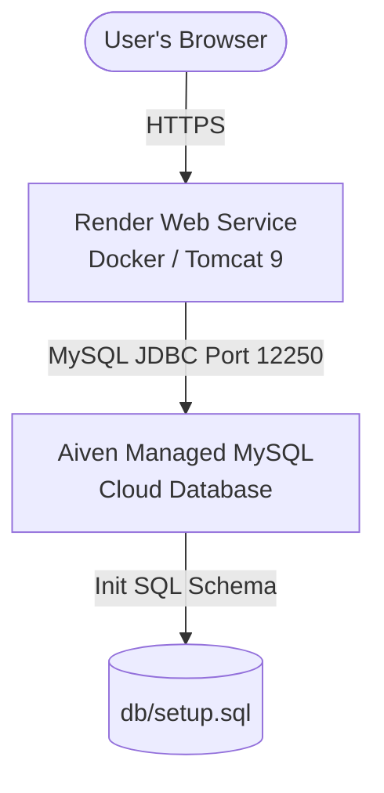

# Deployment Guide: Render + Aiven MySQL

This guide walks you through deploying the **GTU Student Portal** to the cloud using **Aiven** (for a managed MySQL database) and **Render** (for the Tomcat Web Service).

---

## Architecture Diagram

The deployment architecture consists of a containerized Java Tomcat web server running on Render connecting to a secure managed MySQL server running on Aiven:

---

## PART 1 — Setting Up Aiven MySQL

[Aiven](https://aiven.io/) provides a fully managed MySQL instance with a free tier.

### 1. Create a MySQL Service on Aiven
1. Sign up or log into [Aiven Console](https://console.aiven.io/).
2. Click **Create Service**.
3. Choose **MySQL** as the service type.
4. Choose the cloud provider (e.g., AWS, GCP, or DigitalOcean) and select a region closest to you or Render (e.g., `Oregon` or `Frankfurt`).
5. Select the **Free** (or Hobbyist) plan.
6. Give your service a name (e.g., `gtu-mysql`) and click **Create Service**.

### 2. Retrieve Connection Credentials
Once the database state changes to **Running**, copy the connection details from the service summary:
* **Host**: (e.g., `setup-patelvedang20001016-581b.l.aivencloud.com`)
* **Port**: (e.g., `12250`)
* **User**: `avnadmin`
* **Password**: (A long random string, e.g., `AVNS_tqrZqAsowc44WoezMmw`)
* **Database Name**: `defaultdb`

### 3. Configure IP Allowed List (Firewall)
Aiven blocks all external IPs by default. You need to allow connections:
1. In the Aiven MySQL service dashboard, locate the **Allowed IP Addresses** section.
2. Add `0.0.0.0/0` to allow connections from all public IPs. This is required because Render's outbound IPs are dynamic.
   > [Spacer]
   > For maximum security in production, you can lock down IPs, but for simple Render deployments, `0.0.0.0/0` is standard.

---

## PART 2 — Preparing the Project for Render

Render uses the project's root `Dockerfile` to automatically build and package your Java Servlet/JSP app inside a Tomcat container. 

The app contains an automated database initializer in `DBConnection.java`. On the first launch, the app checks if the `students` table exists in your Aiven MySQL database. If not, it executes `db/setup.sql` automatically, so **you do not need to manually import your SQL schema**!

---

## PART 3 — Deploying Web Service to Render

[Render](https://render.com/) will host the Docker container.

### 1. Create a Render Web Service
1. Sign up or log into [Render](https://render.com/).
2. Click **New +** and select **Web Service**.
3. Connect your GitHub account and select your repository: **`vedang1610/gtu-student-portal`**.

### 2. Configure Service Details
In the creation wizard, fill in the following configuration details:
* **Name**: `gtu-student-portal` (or any unique name).
* **Region**: Select a region close to your Aiven database region (e.g., US West or Frankfurt).
* **Branch**: `main`
* **Root Directory**: `gtudemo-main` (the subfolder containing your code/Dockerfile).
* **Runtime**: **Docker** (Render will automatically detect the `Dockerfile`).
* **Instance Type**: **Free**

### 4. Add Environment Variables
Scroll down to the **Environment Variables** section and define the following variables so the application knows how to connect to Aiven:

| Key | Value (Example) |
|---|---|
| `JDBC_DRIVER` | `com.mysql.cj.jdbc.Driver` |
| `DB_URL` | `jdbc:mysql://[HOST]:[PORT]/defaultdb?useSSL=true&allowPublicKeyRetrieval=true` |
| `DB_USER` | `avnadmin` |
| `DB_PASS` | `[YOUR_AIVEN_PASSWORD]` |

*Replace `[HOST]`, `[PORT]`, and `[YOUR_AIVEN_PASSWORD]` with your actual Aiven credentials.*

### 5. Deploy!
1. Click **Create Web Service**.
2. Render will trigger a build:
   - It will pull the base Tomcat image.
   - It will compile your Java classes inside the container.
   - It will deploy your servlet app to the root context of Tomcat.
3. Once the build finishes, you will see `Live` status and a URL like:
   `https://gtu-student-portal.onrender.com/`

---

## PART 4 — Verifying the Deployment

1. Visit your Render URL: `https://[your-service].onrender.com/`
2. You will be greeted by the GTU Homepage.
3. Click the **Student Login** button.
4. Log in using one of the default credentials defined in `setup.sql`:
   * **Enrollment No**: `186640307036`
   * **Password**: `62914366`
5. You should successfully view the student dashboard populated with the user details from your Aiven database.
